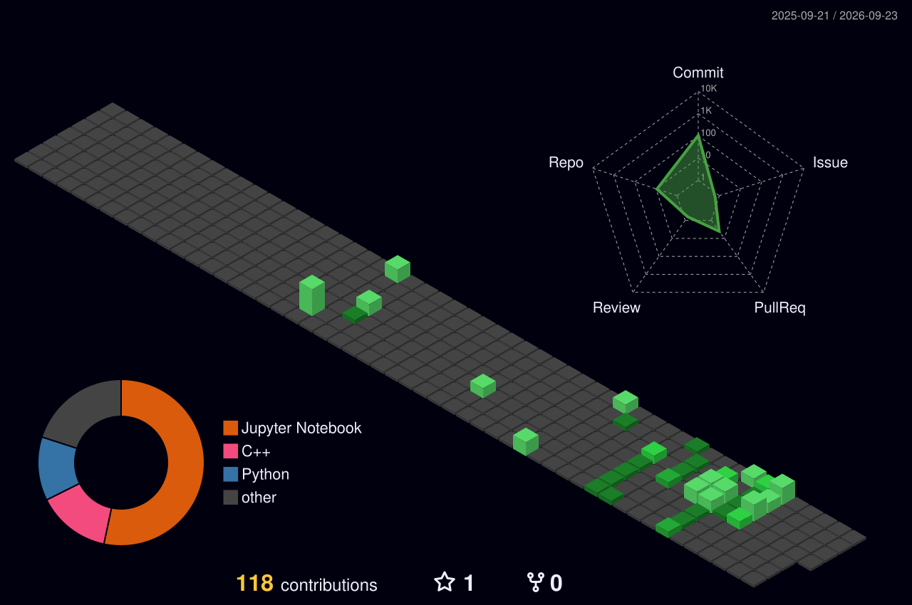

 

 

  

  
    
  

 

A passionate data professional with a robust foundation in engineering and applied mathematics, driven to build machine learning solutions that solve real-world problems. Currently completing my engineering studies at **INSA Centre Val de Loire**, I am advancing my academic journey next year into the **L3 Mathématiques et Applications (Sciences des Données)** program at **Université Paris Cité**. This transition reflects my deep commitment to mastering the mathematical underpinnings of Artificial Intelligence and my drive to push the boundaries of data research.

I specialize in designing end-to-end machine learning pipelines—from exploratory data analysis and rigorous feature engineering to seamless model deployment. With hands-on experience spanning **SNCF MLops, healthcare AI, anime recommendation system, and aviation prediction**, I thrive at the intersection of complex algorithms, big data, and product-centric thinking. I care deeply about writing clean, reproducible code and translating technical complexities into clear, actionable insights.

> [!NOTE]
>  **Currently seeking an Internship (Stage) or Work-Study (Alternance) in Data Science, Machine Learning Engineering, or AI Engineering.**  
> Open to innovative opportunities in France and internationally.

### What drives me:
-  **Building predictive models** that create tangible impact.
-  **Designing robust data pipelines** from messy raw data.
-  **Translating complex analysis** into clear business insights.
-  **Continuous learning** across the ML & MLOps landscape.

  

  

 

### Programming Languages

### ML / Data Science Frameworks

### Tools & Technologies

### Languages

  

  

 

  <table>
    <tr>
      <td align="center" width="50%">
        
      </td>
      <td align="center" width="50%">
        
      </td>
    </tr>
  </table>
   
  

  

  

 

  

  

  

 

  

  

  

 

<table>
<tr>
<td width="50%" valign="top">

**🔬 [Predicting Chronic Kidney Disease](https://github.com/Hoanghoccode2805/Predicting_chronic_kidney_disease)**

End-to-end ML system for CKD detection using Scikit-learn Pipelines and Streamlit — automated preprocessing, model selection, and interactive web UI.

</td>
<td width="50%" valign="top">

**💻 [Laptop Price Intelligence](https://github.com/Hoanghoccode2805/laptop-price-intelligence)**

Full data pipeline analyzing the French laptop market — Selenium scraping → Pandas feature engineering → R/ggplot2 visualization.

</td>
</tr>
<tr>
<td width="50%" valign="top">

**✈️ [EcoFlight Delay Predictor](https://github.com/Hoanghoccode2805/EcoFlight_Delay_Predictor)**

ML model predicting flight delays via Logistic Regression — manual feature engineering on departure deviations and temporal patterns for aviation efficiency.

</td>
<td width="50%" valign="top">

**🏛️ [University Infrastructure Manager](https://github.com/Hoanghoccode2805/University-infrastructure-manager)**

OOP C++ project modeling university infrastructure — class hierarchy, dynamic memory management, operator overloading.

</td>
</tr>
</table>

  

  

 

I'm actively looking for **Data Science** and **ML Engineering** opportunities — feel free to reach out!

 

 

*⭐ If my projects helped you, a star means a lot! ⭐*

